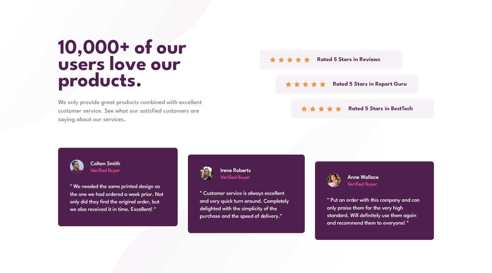

# Frontend Mentor - Social proof section solution

This is a solution to the [Social proof section challenge on Frontend Mentor](https://www.frontendmentor.io/challenges/social-proof-section-6e0qTv_bA). Frontend Mentor challenges help you improve your coding skills by building realistic projects.

## Table of contents

- [Overview](#overview)
  - [The challenge](#the-challenge)
  - [Screenshot](#screenshot)
  - [Links](#links)
- [My process](#my-process)
  - [Built with](#built-with)
  - [What I learned](#what-i-learned)
  - [Continued development](#continued-development)

## Overview

### The challenge

The challenge is to build out this social proof section and get it looking as close to the design as possible.
I can use any tools you like to help me complete the challenge.

Users should be able to:

- View the optimal layout for the section depending on their device's screen size

### Screenshot

### Links

- Solution URL: [https://github.com/ricochet69/SOCIAL-PROOF-SECTION](https://github.com/ricochet69/SOCIAL-PROOF-SECTION)
- Live Site URL: [https://ricochet69.github.io/SOCIAL-PROOF-SECTION](https://ricochet69.github.io/SOCIAL-PROOF-SECTION)

## My process

I adopted a mobile-first approach and built in all of the key elements using flexbox. From there, I gradually added standardised breakpoints to ensure that all of the elements responded correctly to varying screen sizes, and to produce an appealing result.

### Built with

- Semantic HTML5 markup
- CSS custom properties
- Flexbox
- Mobile-first workflow
- B.E.M Methodology

### What I learned

I learned how to effectively use breakpoints at varying screen sizes as well as applying and controlling multiple decorative background images on a web page contained within a single class.

### Continued development

My next area of focus will be CSS Grid and using this as the main layout tool for the next project.
